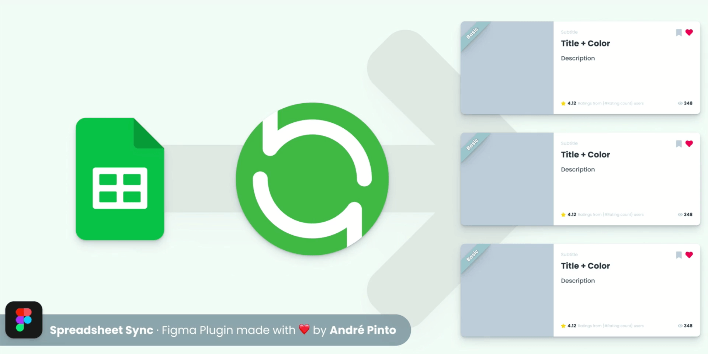

# Spreadsheet Sync

 

## About

Figma plugin to populate dynamic data syncing from a Gogle Spreadsheet (<https://github.com/aPinix/spreadsheet-sync-figma>).

If you ❤️&nbsp;&nbsp;&nbsp;this plugin, give me a follow

and spread some love...

 

## Installation

There is no special installation process. Just install the plugin in figma.
You can find it [**here**](https://www.figma.com/community/plugin/966291261554174793/Spreadsheet-Sync)

 

## What does it look like?

 

## Documention

Being made as we speak... but right now, the plugin page description will sufice.

 

## Feature requests

You can check if it already exists on 'Issues'.

If not, submit a ['Feature request' Issue](https://github.com/aPinix/spreadsheet-sync-figma/issues/new?assignees=aPinix&labels=enhancement&template=feature-request.md)

 

## Bug reports

First check if it already exists in under 'Issues'.

Please submit a ['Bug report' Issue](https://github.com/aPinix/spreadsheet-sync-figma/issues/new?assignees=aPinix&labels=bug&template=bug-report.md)
